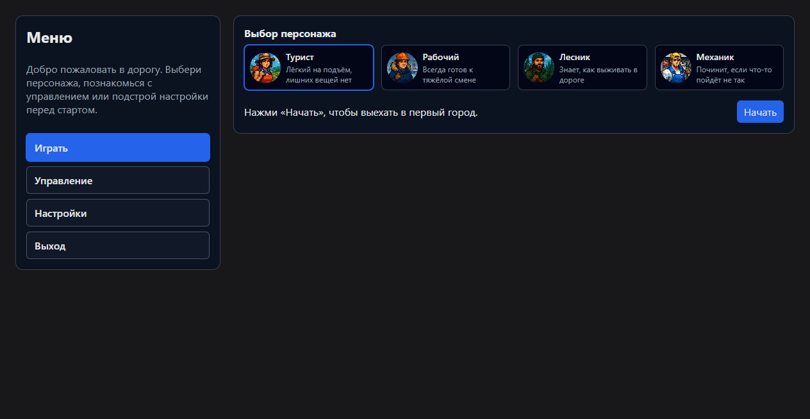
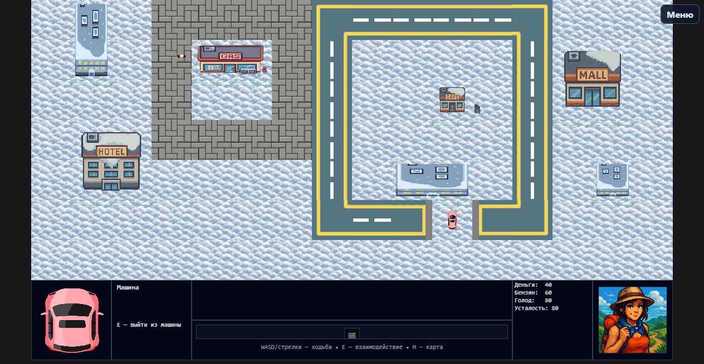

# SnowyPath

Однопользовательская 2D-игра о зимнем путешествии на автомобиле. Маршрут проходит через десять городов: между остановками необходимо следить за топливом, деньгами, едой и усталостью, выбирать попутчиков и планировать дальнейший путь.





## Возможности

- четыре персонажа с разными стартовыми ресурсами и предметами;
- десять точек маршрута и девять дорожных участков;
- заправки, гостиницы, кафе, подработка и интерактивные объекты;
- инвентарь с канистрой и предметами, влияющими на прохождение;
- встречи с попутчиками, диалоги, награды и рискованные события;
- отдельные состояния успешного завершения и поражения;
- полноэкранный и оконный режимы.

## Технологии и архитектура

Electron, JavaScript, HTML Canvas, DOM и CSS. Код разделён на слой данных, базовую игровую логику и сцены `menu`, `stop`, `map`, `road`, `end`. Графика загружается через единый реестр спрайтов; для незавершённых наборов контента предусмотрены fallback-изображения.

## Запуск

Требуется Node.js 24 или новее.

```bash
npm ci
npm start
```

Оконный режим: `npm start -- --windowed`.

## Проверки и сборка

```bash
npm run check
npm test
npm run dist:win
```

`check` проверяет уникальность DOM-идентификаторов и наличие объявленных ассетов. Автоматические тесты покрывают условия завершения маршрута и поражения. Windows-сборка создаёт установщик NSIS и portable-версию в `dist`.

## Управление

| Клавиша | Действие |
|---|---|
| `WASD` / стрелки | движение персонажа |
| `E` | взаимодействие |
| `M` | карта |
| `I` | инвентарь |
| `A` / `D` | управление автомобилем в дороге |
| `Enter` | подтверждение выбора |

## Статус

Версия 1.0 содержит завершённый основной цикл `остановка → карта → дорога → остановка`, полный маршрут и базовый набор дорожных событий. Дальнейшее развитие предполагает расширение уникального контента поздних сегментов и дополнительную балансировку.

Графические материалы входят в состав проекта. Использование ассетов вне SnowyPath требует отдельного разрешения автора.
